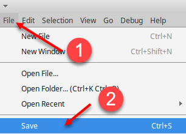
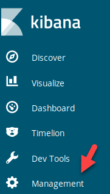
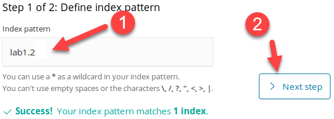
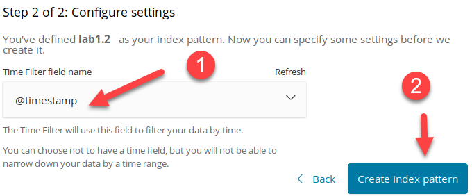
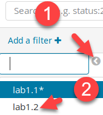

# Lab 1.2 - Log Ingestion from Files and Network Connections

## Objectives

- Perform manual ingestion of log data

- Become familiar with multiple forms of log ingestion

- Understand the difference between picking up logs from a file compared to network ports

- Understand how to ingest files for incident response purposes manually

- Become familiar with debugging or monitoring logs during ingestion

## Exercise Preparation

Log into the Sec-555 VM

- Username: student

- Password: sec555


## Exercises

### Read Logs From Directory

Read logs from **/labs/1.2/\*.log** using **Logstash**. Once **Logstash** is monitoring for **/labs/1.2/\*.log**, copy all **\*.log** files from **/labs/1.2/copy** **to /labs/1.2**

??? tip "Solution"
    First, create a **Logstash** configuration file using the **Visual Studio Code Editor** to read the logs in **/var/log/**.

    ```bash
    code /labs/1.2/student/file.conf
    ```

    Next, enter the configuration needed to read **/var/log/** and output to the screen.

    ```javascript
    input {
    file {
      path => "/labs/1.2/*.log"
    }
    }

    output {
    stdout { codec => rubydebug }
    }
    ```

    !!! note
        By default, Logstash will monitor for changes to a file or directory. This means that if a log already existed in the directory before **Logstash** started, it will not read it. The exception to this is if the file is modified after **Logstash** is started. Because of this behavior, you are starting **Logstash** first, and then copying the log files into **/labs/1.2**.

    Save the file by either using **CTRL + S** or clicking **File -\> Save**. Then **close** out of **Visual Studio Code** by clicking the **X** in the top right corner.  

      

    

    Next, run **Logstash** and tell it to use the **file.conf** configuration file you just created.  

    ```bash
    logstash -f /labs/1.2/student/file.conf
    ```

    !!! note
        The **-f** parameter tells Logstash which configuration file or file to load. In this example, only **file.conf** is loaded. However, **-f** can also be used to load all configuration files in a folder.

    You should see "**Pipelines running**" before continuing.  

    ```javascript
    [2018-05-21T02:44:29,404][INFO ][logstash.pipeline        ] Pipeline started succesfully {:pipeline_id=>"main", :thread=>"#<Thread:0x6229eb40 run>"}
    [2018-05-21T02:44:29,505][INFO ][logstash.agent           ] Pipelines running {:count=>1, :pipelines=>["main"]}
    ```

    Now open a **second terminal**.  

      

    The **second terminal** is going to be used to copy files to **/labs/1.2** while **Logstash** is running in another terminal. In the **second terminal**, run the command below.

    ```bash
    cp /labs/1.2/copy/*.log /labs/1.2/
    ```

    After a few seconds, **Logstash** will begin to process these logs. Switch back to your **original terminal,** and you should see logs like below.  

    ```javascript
    {
         "message" => "Single card detected",
        "@version" => "1",
            "path" => "/labs/1.2/gpu-manager.log",
            "host" => "logstash",
      "@timestamp" => 2018-05-21T02:49:57.402Z
    }
    ```

    This means that **Logstash** is properly monitoring **/labs/1.2/\*.log** for new logs. At this point, you can copy over any text file ending in **.log,** and **Logstash** will process it. Keep the **purple terminal** open as you will need it in further steps.  

    Back in the original terminal hit **CTRL + C** to stop Logstash.  

    ```javascript
    [2018-05-21T03:30:32,161][WARN ][logstash.runner          ] SIGINT received. Shutting down.
    [2018-05-21T03:30:32,600][INFO ][logstash.pipeline        ] Pipeline has terminated {:pipeline_id=>"main", :thread=>"#<Thread:0x4aeac31f run>"}
    ```

### Send Logs on UDP 1055

Send **/labs/1.2/auth.log** to **Logstash** over **UDP** port **1055**

??? tip "Solution"
    First, create a new configuration file called **udp1055.conf**. Do so by running the command below in any terminal.  

    ```bash
    code /labs/1.2/student/udp1055.conf
    ```

    Next, enter the configuration needed to listen on UDP port 1055 and output to the screen.

    ```javascript
    input {
      udp {
        port => 1055
      }
    }

    output {
      stdout { codec => rubydebug }
    }
    ```

    Save the file by either using **CTRL + S** or clicking **File -\> Save**. Then **close** out of **Visual Studio Code** by clicking the **X** in the top right corner.

    Next, run **Logstash** and tell it to use the **udp1055.conf** configuration file you just created.  

    ```bash
    logstash -f /labs/1.2/student/udp1055.conf
    ```

    If your configuration file is working, you should see "**Pipelines running**." At this point, **Logstash** is listening on UDP port 1055. Any data received over UDP port 1055 will be turned into a log. Normally, logs are sent over the network using either **Syslog** or a log agent such as **NXLog**. For this step, we will use **NXLog**.

    The **purple terminal** will be referred to as either the **Agent Terminal** or the **purple terminal**. The next steps are to be performed on the **Agent Terminal**. This is used to visually distinguish between **Logstash**, a log aggregator on the **black terminal**, and **NXLog**, a log agent on the **purple terminal**. Typically, **NXLog** would be run on a remote machine.

    Within the **Agent Terminal**, create an **NXLog** configuration file called **nxlog.conf**.

    ```bash
    code /labs/1.2/student/nxlog.conf
    ```

    Next, enter the configuration needed to send **auth.log** over UDP port 1055 to **Logstash**.  

    ```javascript
    <Input in>
      Module        im_file
      File          "/labs/1.2/auth.log"
      ReadFromLast  FALSE
      SavePos       FALSE
    </Input>

    <Output out>
      Module        om_udp
      Host      logstash
      Port      1055
    </Output>
    <Route 1>
      Path in => out
    </Route>
    ```

    Save the file by either using **CTRL + S** or clicking **File -\> Save**. Then **close** out of **Visual Studio Code** by clicking the **X** in the top right corner.

    In the **Agent Terminal,** run **nxlog-processor** and tell it to use the **nxlog.conf** configuration file you just created.  

    ```bash
    nxlog-processor -c /labs/1.2/student/nxlog.conf
    ```

    !!! note
        The **nxlog-processor** binary is used to process logs and then stop. It is used to invoke NXLog manually or for command line batch jobs. Normally, the **/etc/nxlog/nxlog.conf** file would be edited, and then the **NXLog** service would be restarted. The service would read the logs and then wait for additional changes.

    Back on the **black terminal,** you should have received logs sent from **NXLog**.  

    ```javascript
    {
           "message" => "May 20 18:10:14 ubuntu sudo: pam_unix(sudo:session): session opened for user root by (uid=0)",
              "host" => "172.18.0.9",
        "@timestamp" => 2018-05-21T03:49:57.385Z,
          "@version" => "1"
    }
    ```

    While still on the **black terminal**, hit **CTRL + C** to stop
    **Logstash**.  

    ```javascript
    [2018-05-21T03:50:32,161][WARN ][logstash.runner          ] SIGINT received. Shutting down.
    [2018-05-21T03:50:32,600][INFO ][logstash.pipeline        ] Pipeline has terminated {:pipeline_id=>"main", :thread=>"#<Thread:0x4aeac31f run>"}
    ```

### Send Logs on TCP 1056

Send **/labs/1.2/auth.log** to **Logstash** over **TCP** port **1056**

??? tip "Solution"
    Perform these steps on the **black terminal**. First, create a new configuration file called **tcp1056.conf**.

    ```bash
    code /labs/1.2/student/tcp1056.conf
    ```

    Next, enter the configuration needed to listen on TCP port 1056 and output to the screen.  

    ```javascript
    input {
      tcp {
        port => 1056
      }
    }

    output {
      stdout { codec => rubydebug }
    }
    ```

    Save the file by either using **CTRL + S** or clicking **File -\> Save**. Then **close** out of **Visual Studio Code** by clicking the **X** in the top right corner.  

    Run **Logstash** and tell it to use the **tcp1056.conf** configuration file you just created.  

    ```bash
    logstash -f /labs/1.2/student/tcp1056.conf
    ```

    If your configuration file is working, you should see "**Pipelines running**." At this point, **Logstash** is listening on TCP port 1056.

    This time instead of using **NXLog** to send **auth.log** to Logstash, use **netcat**. This tool is built into many Linux operating systems and can be used to listening on a port or sending content over the network. Switch to the **Agent Terminal** and run the below command.

    ```bash
    nc 127.0.0.1 1056 -q 1 < /labs/1.2/auth.log
    ```

    This will grab the contents of **auth.log** and send them over TCP to port 1056. This would work whether it was done with **NXLog**, **netcat**, or even a scripting language like **PowerShell** or **Python**.

    Back in the **black terminal,** you should have received logs sent from **netcat** such as below.  

    ```javascript
    {
              "port" => 46356,
          "@version" => "1",
              "host" => "172.18.0.1",
           "message" => "May 20 19:34:21 ubuntu sudo: pam_unix(sudo:session): session closed for user root",
        "@timestamp" => 2018-05-21T03:25:35.989Z
    }
    ```

    While still on the **black terminal**, hit **CTRL + C** to stop **Logstash**.

### Send Logs to Storage

Send **/labs/1.2/auth.log** to **Elasticsearch**

??? tip "Solution"
    In the **black terminal**, create a new configuration file called **es.conf**.

    ```bash
    code /labs/1.2/student/es.conf
    ```

    The file will look like this:  

    ```javascript
    input {
      tcp {
        port => 1056
      }
    }

    output {
      elasticsearch { 
        hosts => "elasticsearch"
        index => "lab1.2"
     }
    }
    ```

    Save the file by either using **CTRL + S** or clicking **File -\> Save**. Then **close** out of **Visual Studio Code** by clicking the **X** in the top right corner.

    Run **Logstash** using the **es.conf** configuration file.  

    ```bash
    logstash -f /labs/1.2/student/es.conf
    ```

    You can confirm that Logstash is configured to send logs to **Elasticsearch** because, during start-up, it will display the following log message:  

    ```javascript
    [2018-05-21T03:28:35,581][INFO ][logstash.outputs.elasticsearch] New Elasticsearch output {:class=>"LogStash::Outputs::ElasticSearch", :hosts=>["//elasticsearch"]}
    ```

    Switch to the **Agent Terminal** and use **netcat** to send logs to Logstash using the command below. Because the output is sent to **Elasticsearch,** no logs will be seen from the terminal.

    ```bash
    nc 127.0.0.1 1056 -q 1 < /labs/1.2/auth.log
    ```

    !!! note
        The **-q 1** parameter tells **netcat** to quit one second after reaching the end-of-file (EOF) when sending a file.  

    You can tell when all logs have been sent as the command prompt will be presented again. You can now close out of the **Agent Terminal**. Switch to the **black terminal** hit **CTRL + C** to stop Logstash.  

    ```javascript
    [2018-05-21T03:32:32,161][WARN ][logstash.runner          ] SIGINT received. Shutting down.
    [2018-05-21T03:32:32,600][INFO ][logstash.pipeline        ] Pipeline has terminated {:pipeline_id=>"main", :thread=>"#<Thread:0x4aeac31f run>"}
    ```

### View Logs

View the logs within **Kibana**

??? tip "Solution"
    Open **Firefox** by **clicking** on the **Firefox** **icon** in the top left corner of your student VM.  

      

    If **Kibana** is not loaded, **click** on the **Kibana** bookmark in **Firefox**.

    

    To see logs from a new index, you must tell **Kibana** about the index. To do this, **click** on **Management**.  

    

    Next, **click** on **Index Patterns**.  

      

    Then **click** on **Create Index Pattern**.  

      

    In the **Index pattern** field, enter the index name of **lab1.2**. Then **click** on **Next step**.  

      

    Then select the **Time Filter field name** and **click** on **@timestamp** and **click** **Create index pattern**.  

      

    Now, you can switch back to the **Discover** tab by **clicking** on **Discover**.  

      

    Then select **lab1.2** as your index to view the logs.  

    

    You should now see the logs you have collected.  

      

    !!! note
        If you cannot see any logs, it may be that the logs are older than the last 15 minutes. This is the default time span selected in **Kibana**. You can change this by clicking on the **date picker** in the top right corner. This will allow you to pick a longer period such as the **Last 5 years**.  

    

    Now feel free to browse around the **Kibana** interface and look at the logs ingested. Once complete, you may close **Firefox** and all terminals.  

    !!! note
        Logs may be in Kibana, but they are not parsed. This makes it difficult to search for anything.

<h2 id="video"> Step-by-Step Video Instructions </h2>

<iframe class="tscplayer_inline" id="embeddedSmartPlayerInstance" src="../../../../Videos/555_1/2/v2_lab1.2_player.html?embedIFrameId=embeddedSmartPlayerInstance" scrolling="no" frameborder="0" webkitAllowFullScreen mozallowfullscreen allowFullScreen></iframe>

## Lab Conclusion

In this lab, you have learned the different ways logs can be picked up or transported. This included:

- Using **Logstash** to monitor files or folders for incident handling, forensics, or file share log collection

- Using a log agent such as **NXLog** to ship logs

- Using **netcat** or scripts to transport logs

- Implementing UDP, TCP, and file-based log collection

- Shipping logs off for storage

**Lab 1.2 is now complete**\!

<link href="../../../../Videos/555_1/1/skins/remix/techsmith-smart-player.min.css" rel="stylesheet" type="text/css" />
<link href="../../../../Videos/555_1/1/lab1.1_embed.css" rel="stylesheet" type="text/css">
